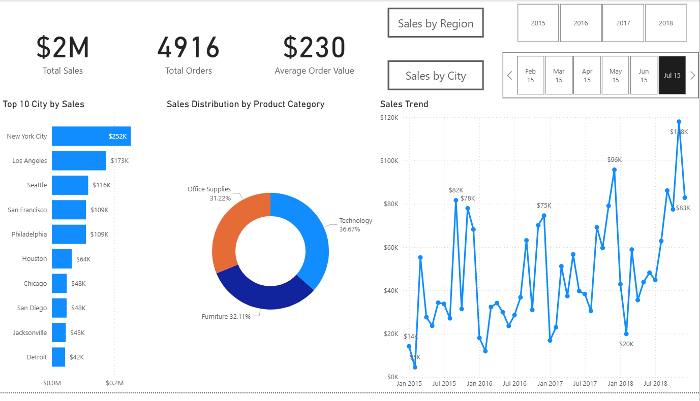

# 📊 Superstore Sales Insights Dashboard

## 📌 Project Overview
The **Superstore Sales Insights Dashboard** is an end-to-end **Data Analytics project** that leverages **SQL, Excel, Python, and Power BI** to analyze sales performance, customer behavior, and product trends from the Superstore dataset.  
The goal is to uncover **key insights** to help stakeholders make **data-driven business decisions**.

---

## 🎯 Objectives
- Analyze **sales performance** across years, regions, and product categories.
- Identify **top-performing cities, customers, and products**.
- Understand **customer segmentation** and **lifetime value (LTV)**.
- Track **shipping performance** and **delivery timelines**.
- Create **interactive dashboards** for dynamic business insights.

---

## 📂 Dataset
**Source:** `superstore_final_dataset.csv` / `SuperstoreData_cleaned_dump_Dataset.sql`  
**Data Fields:**
- **Order Details**: Order ID, Order Date, Ship Date, Ship Mode
- **Customer Info**: Customer ID, Customer Name, Segment, Region
- **Product Info**: Product ID, Category, Sub-Category, Product Name
- **Sales Metrics**: Sales Amount

---

## 🛠 Tech Stack
- **SQL** – Data extraction, cleaning, and advanced queries :contentReference[oaicite:0]{index=0}  
- **Excel** – Initial data preprocessing & pivot analysis  
- **Python (Jupyter Notebook)** – Data cleaning, EDA, and trend analysis  
- **Power BI** – Interactive dashboards & data visualization :contentReference[oaicite:1]{index=1}  

---

## 📈 Key Insights
- 💰 **Total Sales**: $2M across 4 years.  
- 🏙 **Top City by Sales**: New York City ($252K).  
- 📦 **Top Product Category**: Technology ($826K sales).  
- 👥 **Largest Customer Segment**: Consumer (51.58%).  
- 🚚 **Same Day Shipping Rate**: ~X% (calculated via SQL).  
- 📆 Sales show seasonal peaks in Q4 every year.

---

## 📊 Dashboard Features
- **Sales Overview**: Total Sales, Orders, Avg. Order Value  
- **Category Analysis**: Furniture, Office Supplies, Technology trends  
- **Regional & City-Level Analysis**  
- **Customer Insights**: LTV, Segment Distribution, Repeat Rate  
- **Top Products** & **Top Cities** by Sales  
- **Shipping Performance**  

---

## 📜 SQL Analysis Highlights
Some complex business queries answered via SQL :contentReference[oaicite:2]{index=2}:
1. % of same-day shipping orders.
2. Top 3 customers by total order value.
3. Most demanded sub-category in the West region.
4. City contributing the least to total revenue.
5. Customers ordering for 3 consecutive high-value days.

---

## 📷 Dashboard Preview

---
